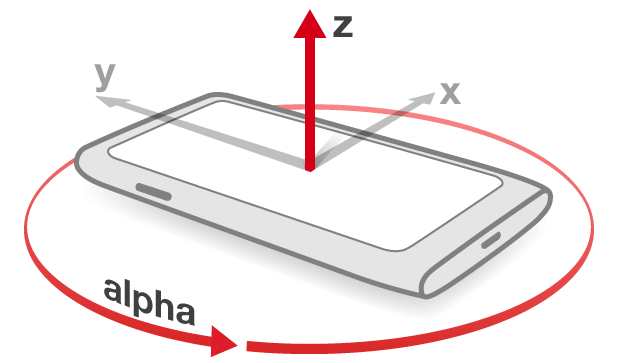
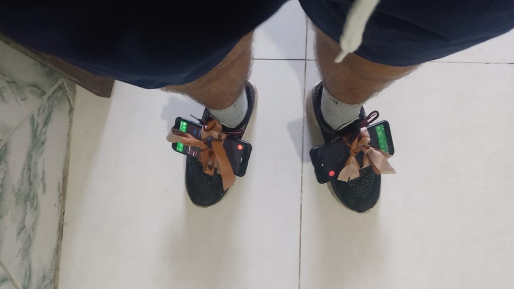
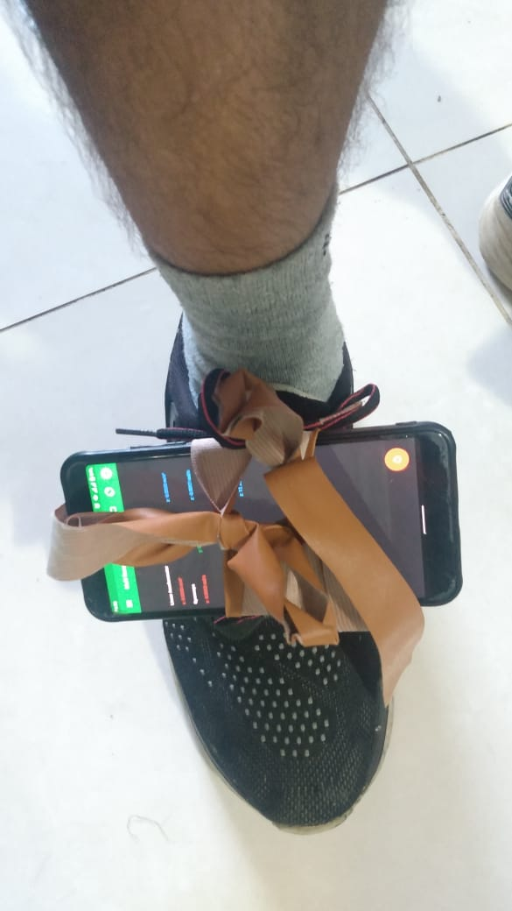
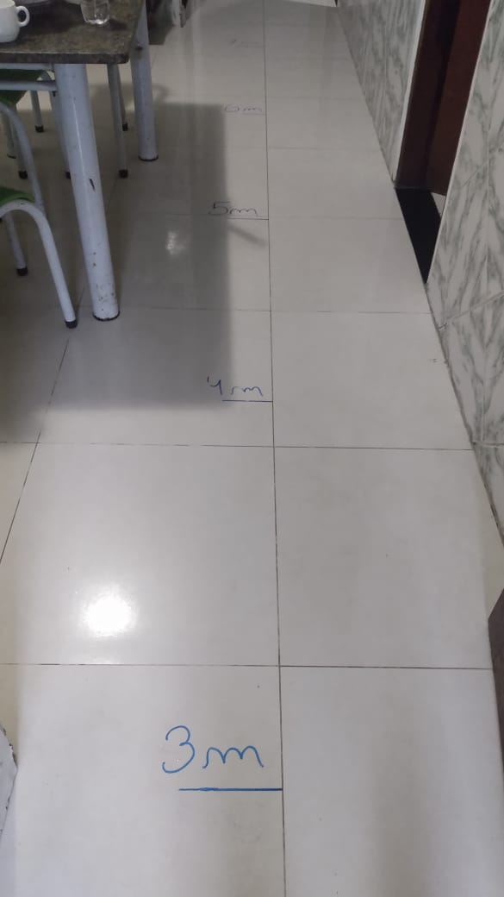

# Datasets - Marcha pé esquerdo e direito
## Experimento 1:
### Objetivo do experimento:
Construiri um dataset dos movimentos dos sensores do pé.
O dataset deve conter dados do pé esquerdo e do pé direito, bem como dos sensores acelerômetro, giroscópio e magnetômetro.

### 1. Coleta dos dados:
#### 1.1 Montagem do experimento:
Os dados foram coletados utilizando dois telefones Xiaomi MiA2, processador 4x 2.2 GHz Kryo 260 Gold + 4x 1.8 GHz Kryo 260 Silver, chipset Snapdragon 660 Qualcomm SDM660.

As avaliações foram performadas por um único sujeito, do sexo masculino, 22 anos, 1,62m de altura e 66kg.

Os eixos do smartphones são descritos na imagem a seguir:

     
    <em>Eixos dos smartphones</em>

Ambos os telefones foram atados aos tênis, sendo amarrados no meio do pé. O eixo y foi apontado no sentido do meio do corpo para fora, como se pode ver na imagem a seguir.

 
<em>Foto dos smartphones atados aos tênis</em>

O aplicativo utilizado para coletar os dados dos sensores foi o Physics Toolbox Sensor Suite, em sua versão gratuita. O lado negativo da versão gratuita é que não é possível configurar uma taxa de hertz antes de executar o experimento. Os smartphones irão registrar em uma taxa de hertz diferente, mas isso será tratado na etapa de processamento dos dados.

O percurso do experimento foi uma pista de 9 metros em linha reta. Antes de realizar a avaliação, o participante do experimento passou um tempo caminhando com os sensores nos pés para se acostumar com os smartphones nos pés.

 
<em>Foto da pista do experimento</em>

#### 1.2 Execução das avaliações:
O participante do experimento foi orientado a realizar 9 vezes o percurso criado para o experimento, sendo que, nas primeiras 3 vezes em ritmo normal, as outras 3 vezes em um ritmo mais acelerado e, por fim, mais 3 vezes em um ritmo mais lento.

As avaliações foram coletadas no dia 18/06/2024 e os arquivos csv gerados pelo aplicativo podem ser encontrados na pasta `Avaliações - Physics - 18-06`. 

### 2. Processamento dos dados:
#### 1.1 Normalização da taxa de hertz:
Como descrito na sessão anterior, a versão gratuita do aplicativo não permite pré-definir a taxa de hertz dos sensores. Sendo assim, iremos ter que normalizar essa taxa para um valor comum aos dois pés.

O passo a passo deste processo pode ser visto no arquivo `data_frequency.ipynb`. Mas em resumo, primeiro se descobriu que a taxa de hertz do pé direito é pouco maior do que 600hz e do pé esquerdo é pouco menor que 300hz. Sabendo disso, os datasets foram reestruturados para terem uma taxa de 256hz. O resultado desse processamento pode ser encontrado na pasta `Avaliações - Physics - 18-06/Dados processados - 256hz`.
